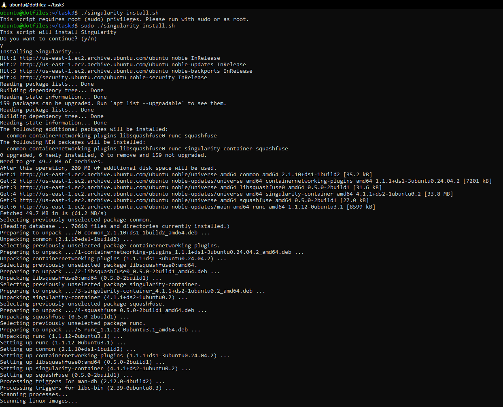
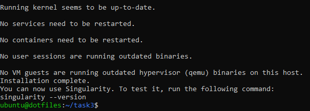

# Task 3 - Software Install

### Root Privilege Check
- The script first checks if the current user has root privileges by inspecting the Effective User ID (EUID). If the script is not running as root (EUID != 0), it prints a message informing the user that the script needs sudo or root access and then exits.

### Package Manager Check
- The script checks if apt (the package manager used on Debian-based systems like Ubuntu) is available. If apt is not installed or not found, the script exits and informs the user that the script requires apt to function.

### User Confirmation
- The script informs the user about the software (Singularity) that will be installed, listing it and its dependencies. It then asks for user confirmation. If the user inputs anything other than "y" (for yes), the script cancels the installation and exits.

### Software Conflict Check
- Before proceeding, the script checks whether a package with the name "singularity" is already installed on the system. If it is, the script exits and informs the user of the conflict.

### Installation
- If the previous checks pass, the script updates the package list with apt update, then installs the Singularity package using apt install.

### Completion Message
- After successful installation, the script notifies the user that the installation is complete and provides a command (singularity --version) to test that the installation worked correctly.

### Screenshots
- This shows that the script needs root and with promt the user to answer (y/n) before installing

- Did not test if apt works or not since I didn't want to break anything by removing apt
- The next screenshot shows that the script tells the user how to check the version that was just installed

#### Citation
- The generative AI used to help make the script was ChatGPT
- The prompt: Write a script that checks if running as root and checks that the system package manager is apt
